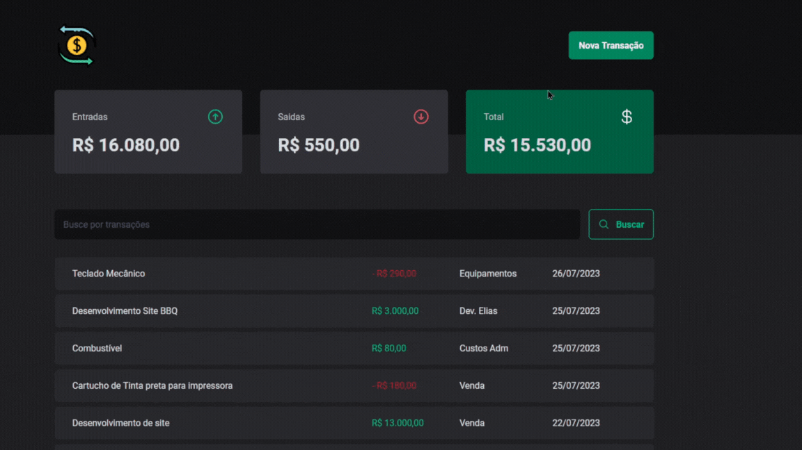

Uma Aplicação desenvolvida para controle de finanças pessoais!

Desenvolvido por Elias Dev.

Este projeto tem o objetivo de simplificar o controle das finanças pessoais.
- Conta com uma interface Simples e Intuitiva.
- Acessibilidade para campos e modais
- Padronização de data e hora
- Consumo e alterações de dados via API

### Previews:

  

## Tecnologias utilizadas
- TypeScript
- React com vite
- React Hook-Form
- Zod
- Styled Components
- Acess Modal
- Scheduler

## Regras Funcionais
- Cadastro de uma nova transação
- Transações podem ser de Entrada (Income) ou Saída(Outcome)
- O usuario terá acesso a um balanço de entradas, saídas e um total
- O usuario poderá filtrar suas transações pelo nome ou tipo
- Os dados serão persistidos via secção

Obs.: Este projeto utiliza o JSON Server em ambiente de desenvolvimento. Porém o projeto já segue as melhores práticas para implementação de uma API própria em qualquer linguagem back-end, sem maiores esforços.

## RoadMap - Implementações Futuras
- Implementação de um sistema de login e registro de usuarios
- Criar sistema Nichos para organizar custos por contextos
- Implementação de autenticação e storage via FireBase e Google Cloud
- Versão do projeto para App Mobile
- Deploy e disponibilização para uso de terceiros